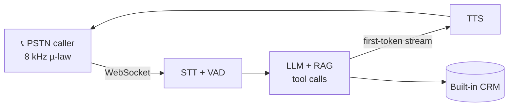

<h1 align="center">Hi, I'm Purunjay 👋</h1>
<h3 align="center">AI Engineer · I build voice agents and LLM systems that hold up in production</h3>

  
  
  

- 🎓 B.Tech CSE (AI & ML) at **VIT Bhopal** (2023 – 2027)
- 💼 Former **AI/ML Intern at Sify Technologies**, doing applied NLP and LLM engineering on an enterprise platform
- 🔬 Main interests: **real-time voice AI**, **document AI**, and **evals for LLM pipelines**
- 🧭 How I work: measure first, use deterministic code where it's enough, and make failures loud so nothing gets fabricated

---

## 🚀 Featured Projects

### 📞 [Real-Time Bilingual Voice Agent (Telephony)](https://github.com/DemonBeastop/Real-Time-Bilingual-Voice-Agent-Telephony)
`Python` `asyncio` `WebSockets` `LLM + RAG`

A production outbound phone agent that places live PSTN calls, switches from English to Hindi mid-sentence when the caller does, answers from a vector-search knowledge base, and books meetings through LLM tool calls.

- Profiled the full round trip at **~2.19 s** and showed the LLM wasn't the bottleneck (0.67 s median TTFT)
- First-token TTS streaming saves **200–300 ms per sentence**, and rolling summarization keeps prompt size from growing quadratically
- Hardened for live calls: single-owner turn detection, stepped failure recovery, and headless evals that don't place real calls

### 🧾 [Invoice / PO Extraction Service](https://github.com/DemonBeastop/invoice-extractor)
`Python` `Vision LLM` `FastAPI` `Tesseract`

Turns invoice and PO PDFs (digital or scanned) into a strict **9-field line-item CSV** with **no templates and no per-vendor rules**.

- Model rotation on rate limits, detection of truncation and decoding loops, and an arithmetic check on totals
- A local-OCR page filter drops non-billing pages before they become image tokens, which cuts inference cost
- Validated on real invoices from **three countries**

### 🛒 [Mandi: Multilingual Voice Shopping Assistant](https://github.com/DemonBeastop/voice-shopping-assistant)
`Python` `FastAPI` `Pydantic` `Next.js`

A voice shopping list that understands English, Hindi and Hinglish (*"do kilo aloo add karo"* → 2 kg potatoes).

- A deterministic parser handles **86% of commands in 0 ms with zero LLM calls**
- **99.6% field-level accuracy** on a 56-case eval suite
- Fallback chain: strict JSON schema → plain-JSON retry → one repair pass. It keeps working without an API key.

<b>More work</b>

- 📍 [**fuzzy-address-matcher**](https://github.com/DemonBeastop/fuzzy-address-matcher): matches messy Indian addresses to known facilities in **~3 ms** with no ML and no geocoding API
- 🚦 [**Smart-City Traffic & Pedestrian Perception**](https://github.com/DemonBeastop/Smart-City-Traffic-Pedestrian-Perception): a video pipeline built on OpenCV, YOLO and EasyOCR
- 🥗 [**VitaQuest**](https://github.com/DemonBeastop/vitaquest): a healthy-eating app with streaks and habits

---

## 💼 Experience

**AI/ML Intern, Sify Technologies**, Chennai · *Jun – Aug 2026*
- Built an address matching engine with **96% accuracy at sub-100 ms** and cut its CPU use by **38%** through profiling
- Rebuilt the internal RAG support bot on BM25, cutting context per query by **70%** (15k → ~4k tokens), with automated tests against prompt injection and XSS
- Shipped a vision-LLM invoice extraction service that fails loudly instead of fabricating data

---

## 🛠️ Tech Stack

  

**Also:** asyncio · WebSockets · SetFit · Sentence-Transformers · RAG · vector search · LLM tool calling · STT/TTS · Streamlit

---

## 📜 Certifications

- **NPTEL Elite: Cloud Computing**, IIT Kharagpur (2025): 25/25 on all assignments, a top performer among 29,703 certified candidates
- **Google Cloud Gen AI Exchange Program**, Hack2skill (2025): Vertex AI, Gemini APIs
- **Google IT Support Certificate**, Google Cloud Skills Boost (2026)

---

<i>Building something with voice or LLMs? I'd like to hear about it. Reach me at <a href="mailto:purun2004@gmail.com">purun2004@gmail.com</a>.</i>

